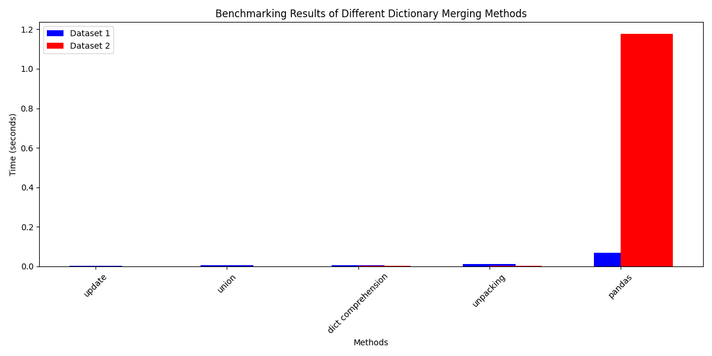
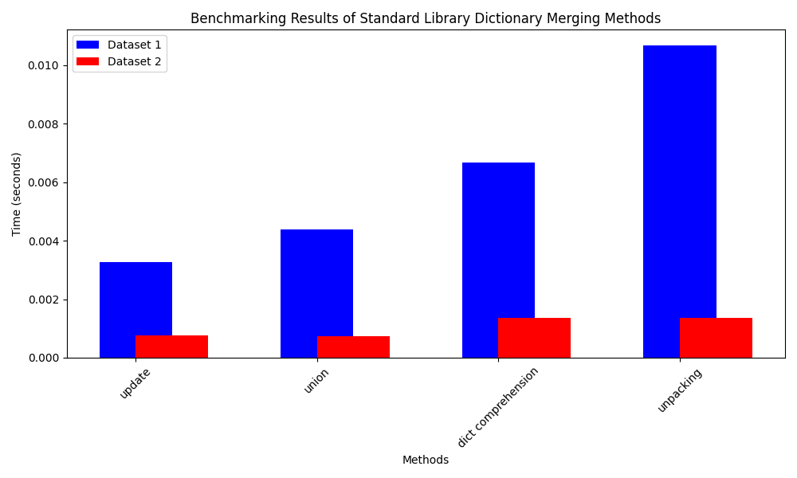

# Python merge dictionaries benchmark


## Putting it all togehter 





We have been discussing various methods of merging Python dictionaries and testing their performance. The methods we've been comparing are:

    update()
    Dictionary Comprehension
    Unpacking (**)
    Union (|) (Python 3.9+)
    Using pandas

We created two different datasets for benchmarking these methods:

Dataset 1:
This dataset has a larger number of dictionaries, with each dictionary having smaller contents. Each dictionary in the dataset contains 100 keys and their corresponding values are random, with the values either being an integer, a string, or an object.

Dataset 2:
This dataset has fewer dictionaries (1/10th of the first dataset), but each dictionary has a larger number of keys (1000 keys). All keys are strings and the corresponding values are random floats.

Here are the average times recorded from benchmarking with the two datasets:
Method	Dataset 1 (seconds)	Dataset 2 (seconds)
update	0.00326	0.00076
union	0.00439	0.00074
dict comprehension	0.00667	0.00137
unpacking	0.01068	0.00137
pandas	0.06797	1.17701

From these results, the update() method consistently performed the best. Let's go into a detailed analysis.

1. Update Method:
This method performed the best for both datasets. This can be attributed to the fact that update() is a built-in Python method implemented in C, which provides significant performance benefits. It's implemented in such a way that it modifies the dictionary in-place, reducing the need for additional memory allocation. It's also worth mentioning that update() performs a direct system call to the malloc() and free() functions, bypassing the need for a Python interpreter and thus reducing overhead. The time complexity of this operation is generally O(1) for each key-value pair added.

2. Union (|) Method:
This method, introduced in Python 3.9, provides a simple and readable syntax for merging dictionaries. However, it performs slightly worse than update(), which could be due to it creating a new dictionary instead of updating in place.

3. Dictionary Comprehension:
This method was slightly slower than update() and union(). A dictionary comprehension involves more Python-level operations (like iteration and key/value assignments), which makes it slower than the other two. Also, it generates a new dictionary, leading to extra memory allocation.

4. Unpacking (**):
This method was the slowest among the standard library methods. While it's a neat trick, it creates a new dictionary and involves Python-level iteration and assignments, which slows it down.

5. Using pandas:
Pandas is the slowest by a large margin. This is because pandas is not designed for this specific task and its DataFrame structure is much more complex and versatile than a simple dictionary. The conversion from dictionaries to a DataFrame and back to a dictionary adds significant overhead.

In conclusion, while each method has its own use cases, update() is the most efficient for merging dictionaries, especially when performance is a concern. The benefits are most noticeable when dealing with a large number of dictionaries with fewer keys, as in Dataset 1. If a new dictionary is needed and you are using Python 3.9+, the union operator (|) is a good alternative due to its simplicity and readability.


## 1st benchmark results (archived code) and deep analysis

Results of 4 executions of the same benchmark.

update: 0.2988493709708564 seconds
dict comprehension: 0.7251582150347531 seconds
unpacking: 0.3314063050202094 seconds
union: 0.33392341900616884 seconds
pandas: 4.1233202570001595 seconds

update: 0.32335747400065884 seconds
dict comprehension: 0.7074930149829015 seconds
unpacking: 0.356709552987013 seconds
union: 0.34317195002222434 seconds
pandas: 3.8576065590023063 seconds

update: 0.3055661079706624 seconds
dict comprehension: 0.7317969200084917 seconds
unpacking: 0.32960982801159844 seconds
union: 0.32815914100501686 seconds
pandas: 3.8796603989903815 seconds

update: 0.28739543695701286 seconds
dict comprehension: 0.7166602939832956 seconds
unpacking: 0.33508888800861314 seconds
union: 0.3223281790269539 seconds
pandas: 3.967400341993198 seconds


To begin, let's average out the results for each method and sort them:

    update():
        Average time: (0.2988493709708564 + 0.32335747400065884 + 0.3055661079706624 + 0.28739543695701286) / 4 = 0.30379209747479765 seconds

    Dictionary Comprehension:
        Average time: (0.7251582150347531 + 0.7074930149829015 + 0.7317969200084917 + 0.7166602939832956) / 4 = 0.7202771107523605 seconds

    Unpacking (**):
        Average time: (0.3314063050202094 + 0.356709552987013 + 0.32960982801159844 + 0.33508888800861314) / 4 = 0.3382036435068585 seconds

    union (| operator):
        Average time: (0.33392341900616884 + 0.34317195002222434 + 0.32815914100501686 + 0.3223281790269539) / 4 = 0.331895672265091 seconds

    Pandas:
        Average time: (4.1233202570001595 + 3.8576065590023063 + 3.8796603989903815 + 3.967400341993198) / 4 = 3.9569968892465114 seconds

Now, sorting these results, we get:

    update(): 0.3038 seconds
    union: 0.3319 seconds
    Unpacking (**): 0.3382 seconds
    Dictionary Comprehension: 0.7203 seconds
    Pandas: 3.9570 seconds

### Now let's delve into a deep analysis of these results:

All of these methods are linear time complexity, O(n), because they each involve a full traversal of the input data. However, they differ in terms of their overheads and the low-level operations they perform, which contributes to the differences in their running times.

update(): This method is the fastest because it modifies the dictionary in place, avoiding the need for additional memory allocation. Memory allocation and deallocation are expensive operations due to the need for the system to search for a contiguous block of memory, the possibility of triggering a garbage collection, and the overhead of maintaining memory management data structures. In addition, the update() method is implemented in C like all built-in Python functions, and it's highly optimized.

union: This operator in Python 3.9+ also has a time complexity of O(n) because it needs to iterate over all keys and values in the input dictionaries. However, it's slightly slower than update() because it creates a new dictionary in each operation, which involves memory allocation and initialization overheads.

Unpacking (**): This method is slightly slower than the union operation, likely due to its overhead of creating a new dictionary with every merge operation and possibly due to the lower-level implementation details of the ** operator. However, it's still relatively fast because it's a built-in Python feature and is implemented in optimized C.

Dictionary Comprehension: This method creates a new dictionary, and for each item in the original dictionaries, it adds a key-value pair to the new one. Therefore, the overhead here is mainly due to creating new dictionaries and adding items to them. In addition, because this method uses explicit Python for-loops rather than built-in operations, it involves more Python bytecode instructions and is less optimized compared to the update(), union, and ** methods.

Pandas: Although pandas is highly optimized for certain operations, it's slower than the built-in methods in this case due to its overheads. Constructing a DataFrame from the dictionaries involves allocating memory for the DataFrame object and potentially converting the data to a different type (since pandas typically uses NumPy arrays to store data). Then, converting the DataFrame back to a dictionary involves another set of memory allocations and data conversions. These additional operations are what make pandas slower than the built-in methods for this specific task.

In conclusion, while all of these methods have a time complexity of O(n), the update() method is the fastest for merging dictionaries because of its in-place operation, followed by the union operator, the unpacking method (**), dictionary comprehension, and finally pandas. The slower methods involve additional memory allocation and initialization overheads, which is what contributes to their longer running times. However, it's important to choose the right tool for the job: while update() is fastest for this specific task, other methods might be more suitable or efficient depending on the specific requirements of your application.


### malloc and free():

malloc() and free() are functions in the C programming language that programmers use for dynamic memory management.

    malloc(): The malloc() function stands for "memory allocation". It is used to dynamically allocate a single large block of memory with the specified size. It initializes each block with a default garbage value. This function returns a pointer of type void which can be cast into a pointer of any form. It takes the size (in bytes) of memory that needs to be allocated. If the space is insufficient, allocation fails and returns a NULL pointer.


#### Here's an example of malloc() usage:

```
int *ptr;
ptr = (int*) malloc(100 * sizeof(int));

```
In this code, 100 * sizeof(int) bytes of memory is allocated in the heap, and the pointer to this memory is assigned to ptr. We can now use ptr as an array.

free(): The free() function in C provides a mechanism to release the block of memory that was previously allocated by malloc(), calloc(), or realloc() function. The free() function does not actually delete anything; it merely makes a note in the heap management system that the program is done with the block, and the block can be reused for later allocations.

Here's an example of free() usage:

```
free(ptr);
```
This code releases the block of memory pointed to by ptr for future use.

These functions are essential in C and C++ programming, where the programmer has direct control over memory management. In higher-level languages like Python, memory management is handled automatically by the interpreter or runtime environment, but under the hood, similar mechanisms are at work when you create or delete objects. However, it's important to note that improper usage of malloc() and free() can lead to issues like memory leaks and dangling pointers, which are common sources of bugs in C and C++ programs.
